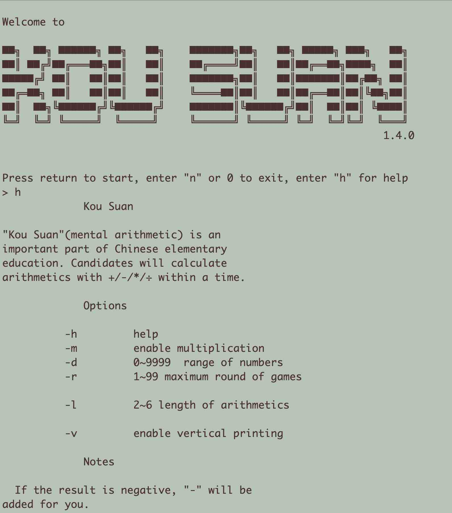
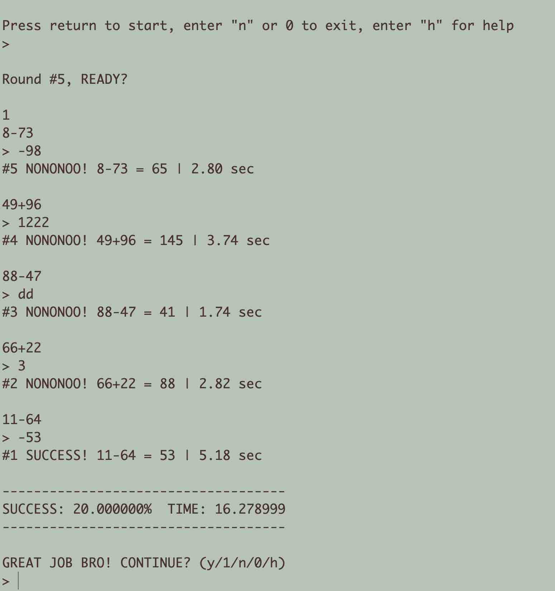

# KouSuan

"Kou Suan", (Chinese: 口算), also known as Mental Calculation, is part of the Chinese primary education. 

This application is developed in C++ 17 and managed by CMake. It supports the following features:

1. Randomly generates arithmetics including addition, substraction, multiplication and integers range from -9998 to 9999.
2. Supports game for several rounds
3. User-defined game rounds, length of arithmetic and operations

## Compiling

CMake 3.17 or later, compilers supporting C++ 17 is required for compiling. 
